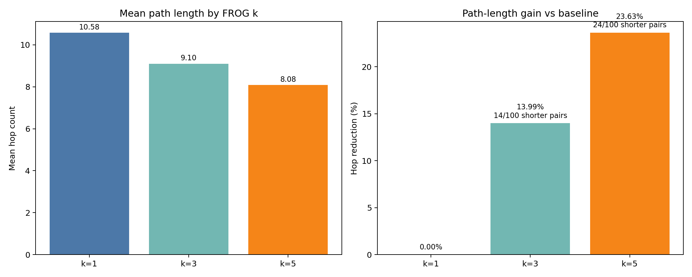
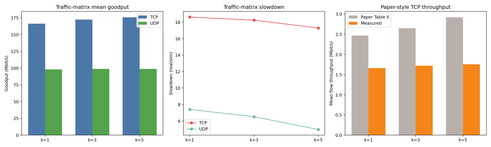
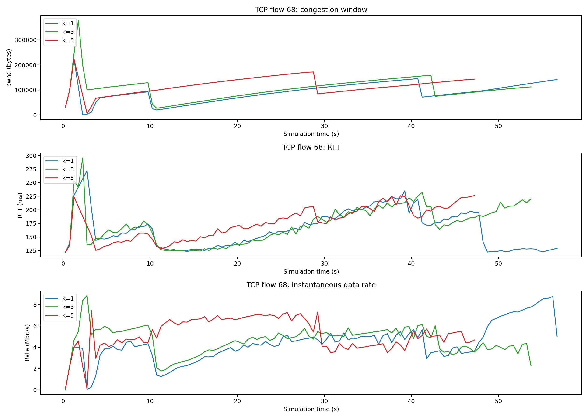

# Report: FROGalgorithm on Hypatia

Date: 2026-03-22 (UTC)
Scope: `report_artifacts/frog_k/`

## 1. What is FROGalgorithm?

In this workspace, FROGalgorithm is a routing variant built on top of Hypatia's dynamic-state generation pipeline for satellite networks. The report compares three configurations for the Telesat-1015 topology:

- `k=1`: baseline Hypatia routing with `algorithm_free_one_only_over_isls`
- `k=3`: FROG variant with `algorithm_free_one_only_over_isls3`
- `k=5`: FROG variant with `algorithm_free_one_only_over_isls5`

All three configurations keep the same high-level Hypatia model:

- one GSL interface per satellite and per ground station
- routing only over inter-satellite links
- no ground-station relaying inside the path
- forwarding state regenerated over time and exported as `fstate_<time>.txt`

The main difference is how the access satellites are chosen for each ground-station pair.

- `k=1` uses the nearest in-range satellite at the source and destination, then follows the shortest path over the ISL graph.
- `k=3` expands the candidate set to the 3 nearest in-range satellites.
- `k=5` expands the candidate set to the 5 nearest in-range satellites.

According to the paper's Algorithm 1, FROG first compares the `k` nearest visible satellites of each ground-station pair and tries the following cases in order:

- a common satellite
- a pair of satellites that are direct ISL neighbors
- otherwise, a source/destination satellite pair offering a shorter path

After that pair-selection step, the forwarding-state calculation is executed using the selected optimal pairs.

In the checked-in implementation in `satgenpy/satgen/dynamic_state/fstate_calculation.py`, the `k=3` and `k=5` variants clearly implement the first two cases:

- common-satellite match
- direct-neighbor match

The third paper condition is only approximated in the current code. The implementation computes shortest-path distances on the ISL graph, but during pair selection it does not explicitly scan all `k x k` candidate pairs and choose the minimum-distance pair. Instead, if no common or direct-neighbor pair is found, it falls back to the default candidate choice and then routes through the shortest path for the selected destination satellite. In practice, FROG is therefore implemented here as an extension of Hypatia's forwarding-state generation step, but the checked-in heuristic is not a verbatim one-to-one transcription of the paper pseudocode.

### How FROG is added on top of Hypatia

The integration path is:

1. `papier2/ns3_experiments/traffic_matrix_load/step_1_generate_runs2.py` creates NS-3 run folders and calls `papier2/satellite_networks_state/generate_for_paper.sh`.
2. `generate_for_paper.sh` invokes the constellation entry point, for this report `papier2/satellite_networks_state/main_telesat_1015.py`.
3. `main_telesat_1015.py` calls `MainHelper.calculate(...)` in `papier2/satellite_networks_state/main_helper.py`.
4. `MainHelper.calculate(...)` generates topology files, ground stations, ISLs, GSL interface info, and then calls `satgen.help_dynamic_state(...)`.
5. `satgenpy/satgen/dynamic_state/generate_dynamic_state.py` dispatches to the selected routing algorithm module:
   - baseline: `algorithm_free_one_only_over_isls.py`
   - FROG `k=3`: `algorithm_free_one_only_over_isls3.py`
   - FROG `k=5`: `algorithm_free_one_only_over_isls5.py`
6. The selected module writes per-timestep forwarding state files consumed later by NS-3 runs.

So the FROG contribution is injected at the dynamic routing-state generation layer, while Hypatia still provides the constellation model, topology generation, and simulation workflow.

## 2. Flow Code Run

### End-to-end execution order

1. Generate the run folders, schedules, commodity pairs, and dynamic-state files.
2. Execute the NS-3 simulations for each routing variant and protocol.
3. Aggregate the finished runs into CSV summaries and default plots.
4. Run report-specific comparison scripts to produce explicit `k=1`, `k=3`, and `k=5` summaries.
5. Generate per-flow TCP figures for qualitative behavior analysis.

### Script-by-script flow

| Script / file | Role in the flow | Main inputs | Main outputs |
|---|---|---|---|
| `papier2/ns3_experiments/traffic_matrix_load/step_1_generate_runs2.py` | Creates the experiment folders and traffic schedules, writes NS-3 configs, stores commodity pairs, then triggers Hypatia dynamic-state generation. | CLI arguments: `debitISL`, constellation entry script, duration, timestep, ISL mode, ground-station selection, algorithm name, thread count. Also uses templates under `templates/`. | `runs/run_loaded_tm_pairing_*`, `config_ns3.properties`, `tcp_flow_schedule.csv` or `udp_burst_schedule.csv`, `papier2/satellite_networks_state/commodites.temp`, and generated topology / forwarding-state directories under `papier2/satellite_networks_state/gen_data/...`. |
| `papier2/ns3_experiments/traffic_matrix_load/step_2_run.py` | Executes the NS-3 simulation for one workload slot. | CLI arguments: `workload_id`, `data_rate_megabit_per_s`, `duration_s`, `algorithm`. Reads the run directory created by step 1. | `logs_ns3/console.txt` and all NS-3 runtime logs inside each run folder, including `finished.txt`, `tcp_flows.csv`, `udp_bursts_incoming.csv`, per-flow TCP logs, and timing results. |
| `papier2/ns3_experiments/traffic_matrix_load/step_3_generate_plots.py` | Scans completed runs and turns them into aggregated CSV data and gnuplot PDFs. | Existing `runs/*/logs_ns3/` folders. Reads `tcp_flows.csv`, `udp_bursts_incoming.csv`, `timing_results.csv`, and `finished.txt`. | `data/run_dirs.csv`, `data/traffic_goodput_total_data_sent_vs_runtime.csv`, `data/traffic_goodput_rate_vs_slowdown.csv`, plus PDFs under `pdf/`. |
| `papier2/ns3_experiments/traffic_matrix_load/runs_logs4.py` | Legacy exploratory TCP visualization script. It overlays cwnd, RTT, and progress for the first TCP flow found in each run. | Run folders under `runs/` and per-flow files such as `tcp_flow_<id>_cwnd.csv`, `tcp_flow_<id>_rtt.csv`, and `tcp_flow_<id>_progress.csv`. | An interactive Matplotlib window only. It does not write report artifacts by default. |
| `report_artifacts/frog_k/scripts/frog_k_compare.py` | Produces the path-length comparison between baseline and FROG variants. | By default it parses `papier2/ns3_experiments/traffic_matrix_load/hop_count.txt`. It can also reconstruct hop counts directly from dynamic-state `fstate_<time>.txt` files. | `report_artifacts/frog_k/frog_k_summary.csv` and `report_artifacts/frog_k/frog_k_summary.json`. |
| `report_artifacts/frog_k/scripts/frog_k_traffic_matrix_compare.py` | Re-labels the step-3 aggregated results into explicit `k=1`, `k=3`, `k=5` comparison tables for TCP and UDP. | `data/run_dirs.csv`, `data/traffic_goodput_rate_vs_slowdown.csv`, `data/traffic_goodput_total_data_sent_vs_runtime.csv`. | `report_artifacts/frog_k/traffic_matrix/frog_k_compare_detail.csv`, `frog_k_compare_summary.csv`, and `frog_k_compare_vs_k1.csv`. |
| `report_artifacts/frog_k/scripts/frog_k_tcp_performance_eval.py` | Creates report-ready TCP flow figures comparing `k=1`, `k=3`, and `k=5` over time. | Run directory root, duration, flow ids, bottom metric (`progress` or `rate`), and smoothing bin size. Reads `tcp_flow_<id>_cwnd.csv`, `tcp_flow_<id>_rtt.csv`, and `tcp_flow_<id>_progress.csv`. | `report_artifacts/frog_k/tcp_performance/flow_<id>_<metric>.png` and `.pdf`. |

### Practical relation between the scripts

- `step_1_generate_runs2.py`, `step_2_run.py`, and `step_3_generate_plots.py` form the main experiment pipeline.
- `runs_logs4.py` is a manual inspection helper.
- `frog_k_compare.py`, `frog_k_traffic_matrix_compare.py`, and `frog_k_tcp_performance_eval.py` are report-oriented post-processing scripts built on top of the raw Hypatia and NS-3 outputs.

## 3. The Result

### 3.1 Path Length Evaluation

Source files:

- `frog_k_summary.csv`
- `frog_k_summary.json`

| Comparison | Pairs | Shorter paths | Worse paths | Equal paths | Baseline mean hops | Candidate mean hops | Mean hop reduction | Reduction (%) |
|---|---:|---:|---:|---:|---:|---:|---:|---:|
| `k=3` vs `k=1` | 100 | 14 | 0 | 86 | 10.58 | 9.10 | 1.48 | 13.99% |
| `k=5` vs `k=1` | 100 | 24 | 0 | 76 | 10.58 | 8.08 | 2.50 | 23.63% |

Analysis:

- Path length improves monotonically as `k` increases. The baseline mean hop count is `10.58`, it drops to `9.10` for `k=3`, and to `8.08` for `k=5`.
- The improvement is not caused by a few bad tradeoffs. In this 100-pair sample there are `0` worse paths for both FROG variants.
- `k=3` shortens `14` out of `100` sampled pairs, while `k=5` shortens `24` out of `100`. The remaining pairs stay unchanged, which means the gain comes from a subset of pairs where the wider access-satellite candidate set matters.
- The stronger result for `k=5` is consistent with the implementation: allowing 5 candidate access satellites gives the forwarding-state generator more opportunities to avoid an unnecessary first or last satellite hop.
- This section is based on the sampled hop-count summary used by `frog_k_compare.py` with the current `hop_count.txt` input. It shows directional improvement clearly, but it is still a sampled evaluation, not an exhaustive enumeration of every possible pair.

### 3.2 Throughput Evaluation

Source files:

- `traffic_matrix/frog_k_compare_summary.csv`
- `traffic_matrix/frog_k_compare_vs_k1.csv`
- `paper_style/paper_style_tcp_summary.csv`

### Traffic-matrix throughput summary

| Protocol | Metric | `k=1` | `k=3` | `k=5` |
|---|---|---:|---:|---:|
| TCP | Mean goodput (Mbit/s) | 166.274 | 172.228 | 175.698 |
| TCP | Mean slowdown | 18.618 | 18.244 | 17.290 |
| UDP | Mean goodput (Mbit/s) | 98.074 | 98.656 | 98.857 |
| UDP | Mean slowdown | 7.403 | 6.520 | 4.964 |

### Delta versus baseline `k=1`

| Protocol | Candidate | Goodput delta (%) | Slowdown delta (%) |
|---|---|---:|---:|
| TCP | `k=3` | +3.58% | -2.01% |
| TCP | `k=5` | +5.67% | -7.14% |
| UDP | `k=3` | +0.59% | -11.93% |
| UDP | `k=5` | +0.80% | -32.95% |

Analysis:

- The traffic-matrix results show consistent aggregate improvement as `k` increases.
- For TCP, both goodput and slowdown move in the right direction. `k=5` gives the best result: `175.698` Mbit/s mean goodput and `17.290` slowdown, versus `166.274` Mbit/s and `18.618` for baseline `k=1`.
- For UDP, the goodput increase is small in absolute terms, but slowdown improves substantially. The strongest effect is at `k=5`, where slowdown falls from `7.403` to `4.964`, a `32.95%` reduction.
- This pattern suggests that FROG's main benefit in the traffic-matrix experiment is not only raw throughput. It also reduces the runtime penalty of the simulation, especially for UDP and, to a lesser extent, for TCP.

### 3.3 TCP Performance Evaluation
TCP performance evaluation for data transmission between Paris and Kabul

Source files:

- `tcp_performance/flow_68_rate.png`
- `tcp_performance/flow_68_rate.pdf`

This figure compares one TCP flow (`between Paris and Kabul`) across the three routing variants. The top subplot shows congestion window, the middle subplot shows RTT, and the bottom subplot shows instantaneous sending rate.

Analysis:

-  TCP data transmission performs better if 3-nearest or 5- nearest algorithm is used. For example, for data transmission between Paris and Kabul ground stations, with the use of 5-nearest, TCP transmits much faster the data (in 47 seconds) than with the use of 1-nearest (in 57 seconds of simulation).

## 4. Conclusion

FROGalgorithm improves the current Hypatia-based experiment in two clear ways.

- It reduces path length relative to baseline shortest-path access selection.
- It improves traffic-matrix performance, with the strongest overall result at `k=5`.

The strongest routing result in the current artifacts is `k=5`, which cuts mean hop count from `10.58` to `8.08` and improves TCP goodput by `5.67%` while reducing TCP slowdown by `7.14%`. UDP also benefits, mainly through a large slowdown reduction.

 So the current conclusion is:

- FROG improves the implemented Hypatia workflow and the generated NS-3 results.
- `k=5` is the best-performing configuration among the three tested values in this artifact set.